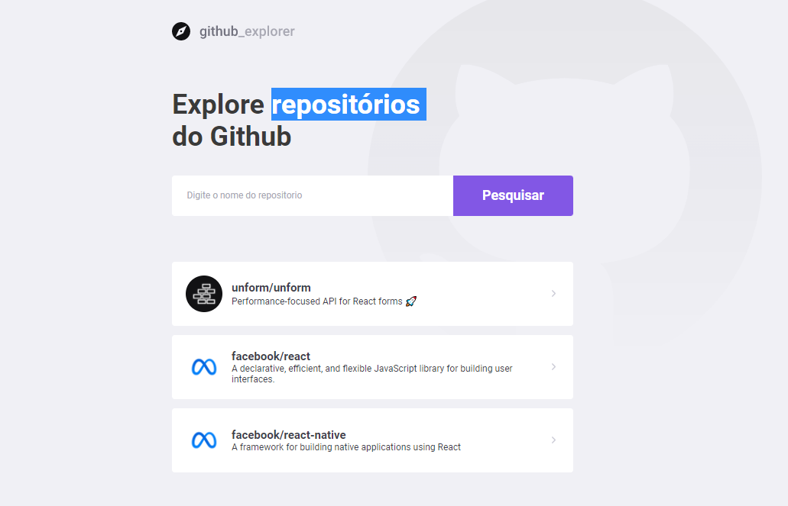
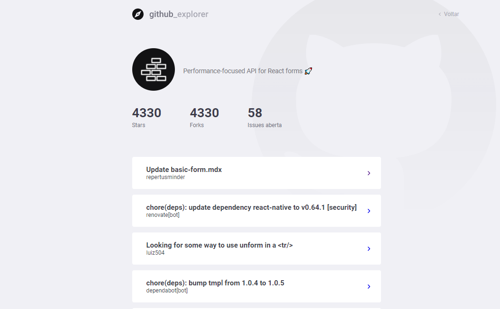

<b>Projeto para Lista dados da Api do Github🧡</b>

## :bookmark: Sobre

O <strong> Github Explore </strong> é uma aplicação Web voltada para listar informações dos repositorios.
<br>

## Conceitos aprendido

### Styled components

### Consumo de Api com Axios

### hooks

### Salvando dados no localStorage

## :heavy_check_mark: :computer:Resultado WEB

<br><br>

<h1 align="center">
    
</h1>

<br/>
<h1 align="center">
    
</h1>

<p align="center">
  <a href="#sobre">Projeto</a>&nbsp;&nbsp;&nbsp;|&nbsp;&nbsp;&nbsp;
  <a href="#tecnologias-utilizadas">Tecnologias</a>&nbsp;&nbsp;&nbsp;|&nbsp;&nbsp;&nbsp;
  <a href="#como-usar">Como Usar</a>&nbsp;&nbsp;&nbsp;|&nbsp;&nbsp;&nbsp;
  <a href="#Como-Contribuir">Como Contribuir</a>

</p>

<p align="center">
 

  
</p>

<br>

<a id="sobre"></a>

<a id="tecnologias-utilizadas"></a>

## :rocket: Tecnologias Utilizadas

O projeto foi desenvolvido utilizando as seguintes tecnologias

- [React](https://pt-br.reactjs.org/)

<br>

<a id="como-usar"></a>

## :fire: Como usar

- ### **Pré-requisitos**

  - É **necessário** possuir o **[Node.js](https://nodejs.org/en/)** instalado na máquina
  - Também, é **preciso** ter um gerenciador de pacotes seja o **[NPM](https://www.npmjs.com/)** ou **[Yarn](https://yarnpkg.com/)**.

1. Faça um clone :

```sh
  Front-End
  git clone https://github.com/Rafael-Rufino/Github_Explore.git


```

2. Executando a Aplicação:

```sh
  # Instale as dependências
  $ npm install
  #ou
  $ yarn


  # Inicie a aplicação web
  $ cd github_explore
  $ npm start
  # ou
  $ yarn start


  # Porta de Acesso Liberado
  $ 3000


```

<a id="Como-Contribuir"></a>

## :recycle: Como contribuir

- Faça um Fork desse repositório,
- Crie uma branch com a sua feature: `git checkout -b my-feature`
- Commit suas mudanças: `git commit -m 'feat: My new feature'`
- Push a sua branch: `git push origin my-feature`

🎓 **Quem ministrou?**

As aulas foram ministradas pelo mestre
Diego Fernandes - Instructor - Rocketseat

📝 **License**

Esse projeto está sob a licença MIT. Veja o arquivo [LICENSE](LICENSE.md) para mais detalhes.

<h4 align="center">
    Feito com 💜 by <a href="https://www.linkedin.com/in/rafael-r-dos-santos-b889311ba/" target="_blank">Rafael Rufino</a>
</h4>
